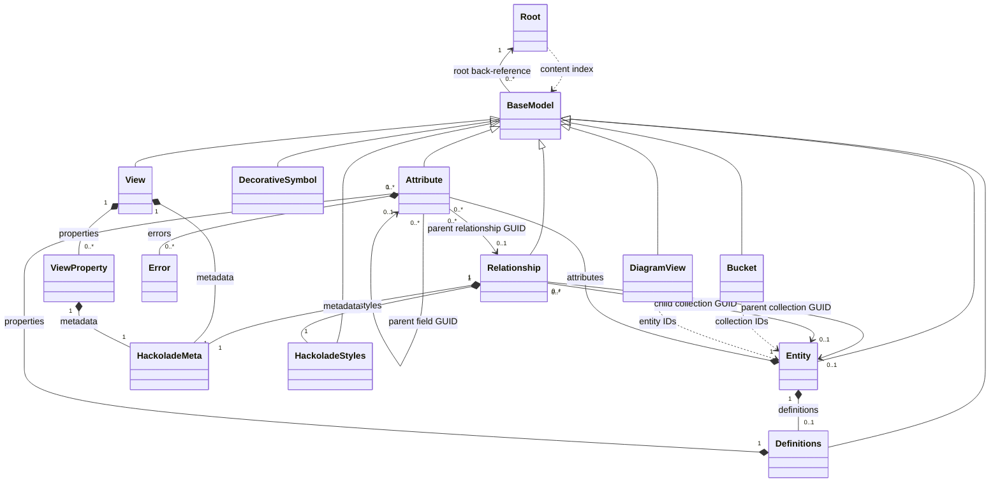

# Hackolade model

This project provides a libarary for serialising and deserialising Hackolade files
for use in model transformation

## Class Diagram

```mermaid
classDiagram
	class Root
	class BaseModel
	class Attribute
	class Bucket
	class DecorativeSymbol
	class Definitions
	class DiagramView
	class Entity
	class Error
	class HackoladeMeta
	class HackoladeStyles
	class Relationship
	class View
	class ViewProperty

	BaseModel <|-- Attribute
	BaseModel <|-- Bucket
	BaseModel <|-- DecorativeSymbol
	BaseModel <|-- Definitions
	BaseModel <|-- DiagramView
	BaseModel <|-- Entity
	BaseModel <|-- HackoladeStyles
	BaseModel <|-- Relationship
	BaseModel <|-- View

	Entity "1" *-- "0..*" Attribute : attributes
	Entity "1" *-- "0..1" Definitions : definitions
	Definitions "1" *-- "0..*" Attribute : properties
	Attribute "1" *-- "0..*" Error : errors
	View "1" *-- "0..*" ViewProperty : properties

	Relationship "0..*" --> "0..1" Entity : parent collection GUID
	Relationship "0..*" --> "0..1" Entity : child collection GUID
	Attribute "0..*" --> "0..1" Relationship : parent relationship GUID
	Attribute "0..*" --> "0..1" Attribute : parent field GUID
	Relationship "1" *-- "1" HackoladeStyles : styles
	Relationship "1" *-- "1" HackoladeMeta : metadata
	View "1" *-- "1" HackoladeMeta : metadata
	ViewProperty "1" *-- "1" HackoladeMeta : metadata

	BaseModel "0..*" --> "1" Root : root back-reference
	Root ..> BaseModel : content index
	Bucket ..> Entity : collection IDs
	DiagramView ..> Entity : entity IDs
```